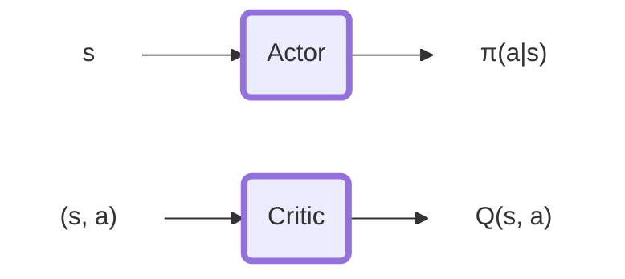
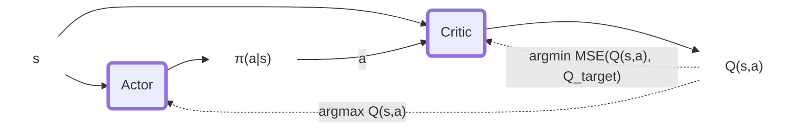

## Intro
In this environment, a double-jointed arm can move to target locations. A reward of +0.1 is provided for each step that the agent's hand is in the goal location. Thus, the goal of your agent is to maintain its position at the target location for as many time steps as possible.

The observation space consists of 33 variables corresponding to position, rotation, velocity, and angular velocities of the arm. Each action is a vector with four numbers, corresponding to torque applicable to two joints. Every entry in the action vector should be a number between -1 and 1.

The first version contains a single agent.
The second version contains 20 identical agents, each with its own copy of the environment.
We focus on the latter, but the code provided can be used to solve the first environment as well. To solve this environment we must:

The agents must get an average score of +30 (over 100 consecutive episodes, and over all agents).

## Environment

In this environment, a double-jointed arm can move to target locations. A reward of +0.1 is provided for each step that the agent's hand is in the goal location. Thus, the goal of your agent is to maintain its position at the target location for as many time steps as possible.

## Solution
### PPO
PPO is an on-policy algorithm based on policy gradient. Here we propose an actor-critic formulation. The actor calculates the action from the state while the Critic generates the value of the state.
This implementation uses a parametrized log standard deviation used for exploring the environment. Specifically the the parameters are used on a log scale so that (after exponentiation) we guarantee strictly positive values.

### DDPG
Deep Deterministic Policy Gradient is an off-policy actor-critic Deep RL algorithm that interconnects the input and outputs of the two networks to select better policy and better value estimation iteratively. $\varepsilon$ $\pi(a|s)$.
Specifically, The actor maps state to action ($s$ -> $\pi(a|s)$) and the critic maps state action pairs to Q returns ($(s,a)$ -> $\hat{Q}(s,a)$).

## Results
### PPO

<!--  -->

### DDPG

