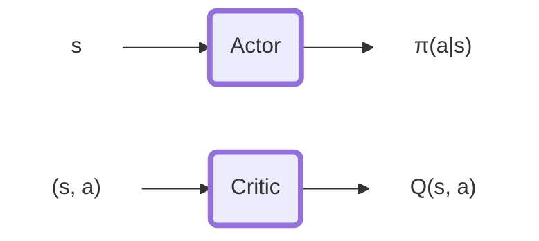
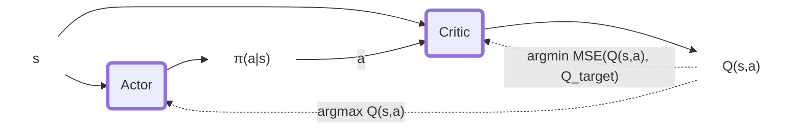

# Intro
The code in this repository implements processes to train and execute autonomous agents that can cooperate in a Tennis game environment.

## Environment
In this environment, two agents control rackets to bounce a ball over a net. If an agent hits the ball over the net, it receives a reward of +0.1. If an agent lets a ball hit the ground or hits the ball out of bounds, it receives a reward of -0.01. Thus, the goal of each agent is to keep the ball in play.

The observation space consists of 8 variables corresponding to the position and velocity of the ball and racket. Each agent receives its own, local observation. Two continuous actions are available, corresponding to movement toward (or away from) the net, and jumping.

The task is episodic, and in order to solve the environment, your agents must get an average score of +0.5 (over 100 consecutive episodes, after taking the maximum over both agents). Specifically,

After each episode, we add up the rewards that each agent received (without discounting), to get a score for each agent. This yields 2 (potentially different) scores. We then take the maximum of these 2 scores. This yields a single score for each episode. The environment is considered solved, when the average (over 100 episodes) of those scores is at least +0.5.
# Solution

In this repository, we solve this environment using two different approaches: `DDPG` and `MA-DDPG`. The first correspond to the Vanilla Version of Deep Deterministic Policy Gradient algorithm commonly used for single agent scenarios. In this instance, the same policy is shared between the two player agents without sharing any in-game information for the opponent. In other words, One policy for 2 agents focused on their local information only.
The second approach (`MA-DDPG`) extends the training behaviour of DDPG to improve the stability in multi-agent scenarios. It does it by extening the Critic of the network to receive also information from the opponent player.

#### DDPG
Deep Deterministic Policy Gradient is an off-policy actor-critic Deep RL algorithm that interconnects the input and outputs of the two networks to select better policy and better value estimation iteratively.

#### MA-DDPG
MA-DDPG is an extension of the DDPG algorithm to Multi-agent problem.
Multi-Agent problems are known to have strongly non-stationary environments if you train the agents individually. On the other side of the spectrum one could train a macro agent that controls the full sets of agents in the environment. However that solution would cause an explosion of the input space for our agent and therefore making training impractical.

MA-DDPG mediates these 2 approaches using its Actor-Critic components. While the Actor remains focused on the individual agents (it is the only part used at the execution time) The critic maintains a global perspective on the state,action value estimation. Indeed it uses the states and actions of both agents to estimate the value of a configuration.

# Results

<!--  -->
Both the approaches reached convergence successfully. The MultiAgent extension provided some benefit in terms of learning stability (there was no collapse in scores mid-learning) and speed of learning (number of episodes required to reach the target).

In the experiments we set a requirements for termination that is higher than the one requested by the environment definition. We terminate the learning phase at the momement we reach a 100 episode average score of 0.6.

Keep in mind that, according to suggestions provided by the assignment, the score should be measured based on the cumulative max score of the 2 agents. We compute the score accordingly.

#### DDPG
DDPG reaches the training target (0.6) in more than 2500 (almost 3000) episodes but it would reach the 0.5 target much earlier than that. The training score collapsed after 2000 episodes and started recovering at episode 2500. This clearly has to do with the stationarity of the environment and an overconfident policy.

Overall, the agent reached the target but vwey slowly and had a collapse once positive results were reached.

#### MA-DDPG
The multi-agent extension provided several benefits on the agent learning. The 0.6 target was met in only 1400 episodes without having any collapse in the training (yet).

As can be observed, the policy learned are quite similar during execution. It reaches an equilibrium in the rackets movements on the central area of the tennis field.

